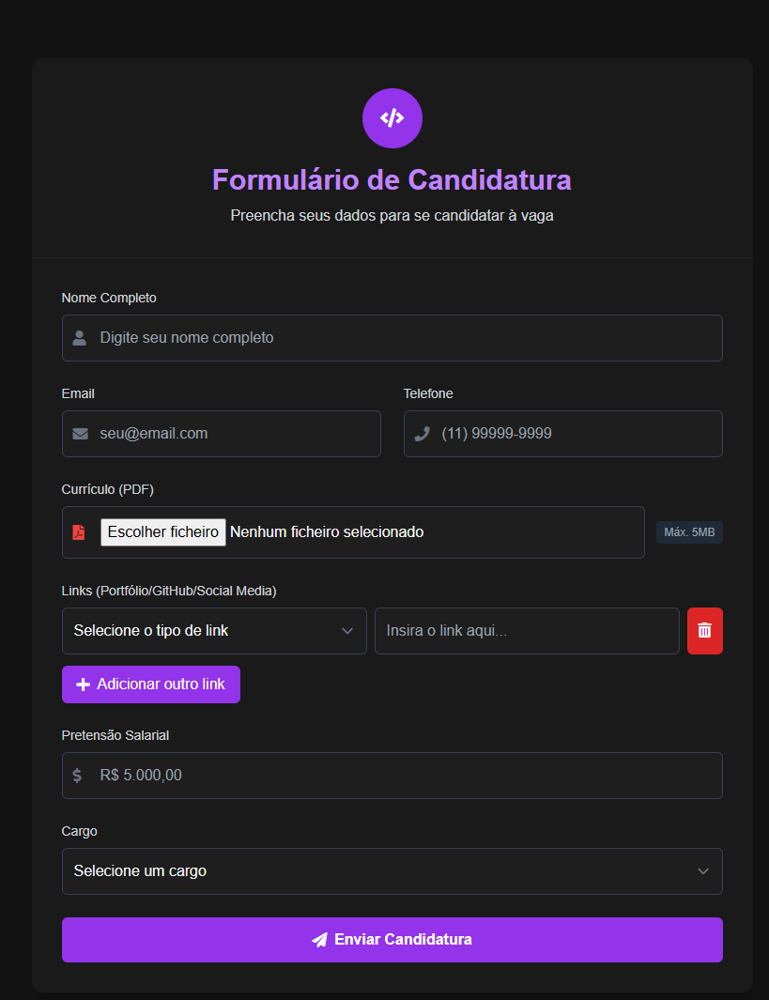

# DevCandidatura 💼⚡  

[](https://github.com/seu-usuario/devcandidatura/releases/tag/v1.0.0)  
[](https://github.com/seu-usuario/devcandidatura/actions)  
[](LICENSE)  

---

## 📸 Preview  

  

---

## 📌 Sobre  

**DevCandidatura** é uma automação inteligente para **cadastro de vagas de emprego** com foco nas áreas de **Automação** e **Desenvolvimento Full Stack**.  

Com ele, você pode agilizar o processo de candidatura em diferentes oportunidades, garantindo organização, produtividade e praticidade.  

**Funcionalidades principais:**  
- Automação de cadastros em múltiplas plataformas.  
- Interface simples e responsiva para uso rápido.  
- Fluxos inteligentes via **n8n**, reduzindo tempo e erros manuais.  
- Integração com formulários e processamento automatizado de dados.  

---

## 🔧 Tecnologias  

  
  
  
  

---

## 🎨 Funcionalidades  

- 📑 Cadastro automatizado de vagas.  
- ⚡ Integração com formulários online.  
- 🤖 Fluxos de automação criados no **n8n**.  
- 📊 Organização e histórico de candidaturas.  
- 💻 Layout moderno e responsivo com **Tailwind**.  

---

## 🖼️ Exemplo de Fluxo  

```mermaid
flowchart TD
    A[Formulário HTML] --> B[n8n Workflow]
    B --> C[Processamento de Dados]
    C --> D[Cadastro Automático em Plataforma]
    D --> E[Confirmação e Histórico]
